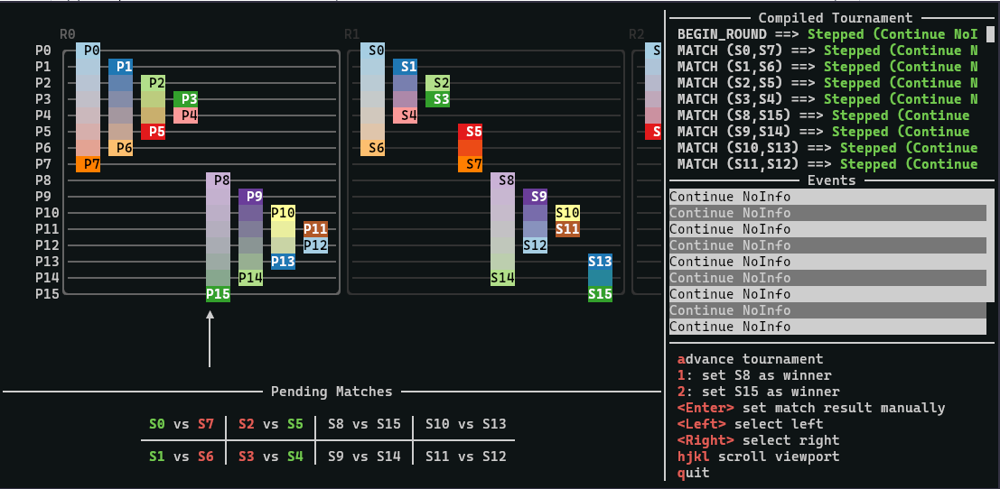

# Journeyman

An eDSL for creating tournaments. Use it as a library in a project that uses
tournaments.



# Documentation access

- Core documentation is hosted at https://mikeplus64.github.io/journeyman
- The thesis document is available at https://mikeplus64.github.io/journeyman/thesis.pdf

# Development setup

You can set up a development environment with journeyman by using
[Nix](https://nixos.org/).

``` sh
$ git clone git@github.com:mikeplus64/journeyman.git
$ cd journeyman
$ nix develop
$ just repl
  # Much loading and module compilation goes here :-)
$ :set -iapp -isrc
$ :l app/Main.hs
$ :main
  # Make changes here to app/Main.hs; to e.g., add a tournament structure
  ^C
$ :reload
$ :main
```

This provides a convenient entry-point to adding and inspecting existing
tournaments. You can modify the `knownTournaments` list to include any
tournament format you declare

I have tested journeyman on Linux only, although macOS should work easily enough
as well. On Windows, it may be easier to set up a Haskell environment through
Windows Subsystem for Linux.

## Setup without Nix

If you rather not use Nix or Just, you can call use `cabal` directly. Journeyman
was developed with GHC 9.4.7 and cabal-install version 3.10.1.0, and should be
portable to most systems with those available.

``` sh
$ cd journeyman
# Boot up a development REPL as in above
$ cabal repl
# Install a journeyman-ui binary to your $PATH
$ cabal install
# Build documentation
$ cabal haddock
```

